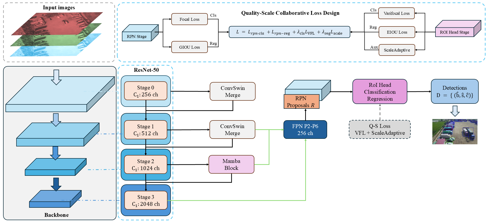
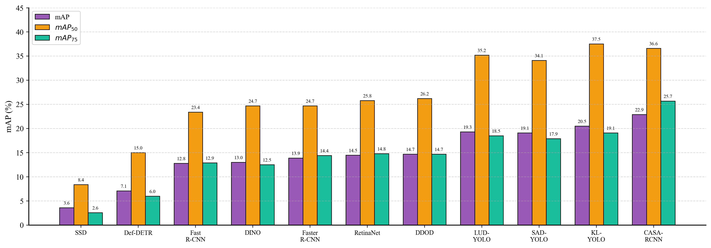
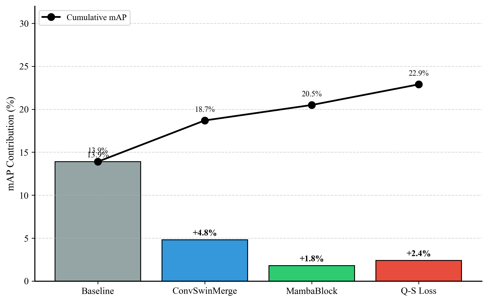

# CASA-RCNN

**Context-Adaptive Scale-Aware RCNN for UAV Aerial Object Detection**

---

## Framework

  

---

## Abstract

Unmanned aerial vehicle (UAV) aerial imagery presents persistent challenges for object detection, including **dense small objects**, **large scale variation**, **cluttered backgrounds**, and **stringent localization requirements**. Conventional two-stage detectors often struggle with fine-grained small-object representation, efficient global context modeling, and classification-localization consistency.

To address these issues, we propose **CASA-RCNN**, a context-adaptive and scale-aware two-stage detection framework tailored to UAV scenarios. CASA-RCNN introduces:

1. **ConvSwinMerge**: A shallow-level enhancement module that strengthens position-sensitive cues and suppresses background interference
2. **MambaBlock**: A deep-level adaptive sequence modeling module that captures long-range dependencies for context reasoning
3. **Varifocal Loss**: Quality-aware classification that aligns confidence scores with localization quality
4. **ScaleAdaptiveLoss**: Dynamic reweighting of regression objectives across object scales

Experiments on the VisDrone2021 benchmark demonstrate that CASA-RCNN yields consistent improvements in overall detection accuracy and small-object performance.

---

## Highlights

| Module | Description |
|--------|-------------|
| **ConvSwinMerge** | Shallow context enhancement combining coordinate attention with channel excitation for position-sensitive modeling |
| **MambaBlock** | Deep context modeling with adaptive sequence modeling for global dependency aggregation |
| **Varifocal Loss** | Quality-aware classification loss that better aligns confidence scores with localization quality |
| **ScaleAdaptiveLoss** | Scale-dependent weighting to compensate for insufficient gradient contribution of small objects |

---

## Main Results

### Comparison with State-of-the-art Methods

Performance comparison on **VisDrone2021-DET validation set**:

| Method | Type | mAP | mAP@50 | mAP@75 | mAP_s | mAP_m | mAP_l |
|--------|------|-----|--------|--------|-------|-------|-------|
| SSD | One-stage | 3.6 | 8.4 | 2.6 | 0.5 | 5.5 | 12.3 |
| Deformable DETR | Transformer | 7.1 | 15.0 | 6.0 | 3.3 | 11.4 | 15.2 |
| Fast R-CNN | Two-stage | 12.8 | 23.4 | 12.9 | 6.4 | 20.0 | 25.6 |
| DINO | Transformer | 13.0 | 24.7 | 12.5 | 7.7 | 20.2 | 25.5 |
| Faster R-CNN | Two-stage | 13.9 | 24.7 | 14.4 | 6.9 | 21.9 | 23.1 |
| RetinaNet | One-stage | 14.5 | 25.8 | 14.8 | 5.9 | 23.7 | 32.4 |
| DDOD | One-stage | 14.7 | 26.2 | 14.7 | 6.9 | 23.1 | 30.9 |
| **CASA-RCNN (Ours)** | Two-stage | **22.9** | **36.6** | **25.7** | **12.5** | **35.7** | **37.9** |

### Performance Improvement over Baseline

| Metric | Faster R-CNN | CASA-RCNN | Improvement | Relative Gain |
|--------|--------------|-----------|-------------|---------------|
| mAP | 13.9% | 22.9% | **+9.0%** | +64.7% |
| mAP@50 | 24.7% | 36.6% | **+11.9%** | +48.2% |
| mAP@75 | 14.4% | 25.7% | **+11.3%** | +78.5% |
| mAP_s | 6.9% | 12.5% | **+5.6%** | +81.2% |
| mAP_m | 21.9% | 35.7% | **+13.8%** | +63.0% |
| mAP_l | 23.1% | 37.9% | **+14.8%** | +64.1% |

  

---

## Visualization

### Detection Results

  

*Comparison of detection results between Faster R-CNN (baseline) and CASA-RCNN on challenging UAV aerial scenes including dense pedestrians, intersections, and parking lots.*

### Feature Visualization

  

*Feature map visualization showing the enhancement effect of ConvSwinMerge on shallow features and MambaBlock on deep features.*

---

## Method Overview

### ConvSwinMerge

The shallow context enhancement module follows an "attention-convolution-excitation" design:

$$X_1 = X + \text{CoordAtt}(X), \quad X_2 = X_1 + \text{Conv}_{3\times3}(X_1), \quad Y = \text{SaE}(X_2)$$

- **CoordAtt**: Coordinate attention for position-sensitive channel recalibration
- **Conv**: Local neighborhood aggregation for edge and texture enhancement
- **SaE**: Channel excitation for discriminative response combination

### MambaBlock

The deep context modeling module uses a dual-branch fusion design:

$$X_m = \mathcal{M}(X), \quad X_i = \mathcal{I}(X), \quad Y = \phi(\text{Concat}(X_m, X_i))$$

- **Enhancement branch**: Adaptive sequence modeling for cross-region information propagation
- **Fidelity branch**: Identity mapping to preserve original semantic information

### Quality-Scale Collaborative Loss

**Varifocal Loss** for quality-aware classification:

$$\mathcal{L}_{\text{VFL}}(p,q) = \begin{cases} -q|q-p|^\gamma\log(p), & q>0 \\ -\alpha p^\gamma\log(1-p), & q=0 \end{cases}$$

**ScaleAdaptiveLoss** for scale-dependent regression weighting:

$$w(s) = \begin{cases} \lambda_s=3.0, & 0 \leq s < 32 \text{ (small)} \\ \lambda_m=2.0, & 32 \leq s < 96 \text{ (medium)} \\ \lambda_l=1.0, & s \geq 96 \text{ (large)} \end{cases}$$

For detailed method description, see [docs/METHOD.md](docs/METHOD.md).

---

## Ablation Study

### Module Contribution

| ConvSwinMerge | MambaBlock | Q-S Loss | mAP | mAP_s | mAP_m | mAP_l |
|:-------------:|:----------:|:--------:|-----|-------|-------|-------|
| | | | 13.9 | 6.9 | 21.9 | 23.1 |
| ✓ | | | 18.7 | 9.8 | 29.3 | 36.9 |
| | ✓ | | 19.1 | 10.1 | 29.7 | 35.7 |
| ✓ | ✓ | | 22.9 | 12.5 | 35.7 | 37.9 |
| ✓ | ✓ | ✓ | **25.8** | **16.7** | **38.9** | **40.2** |

  

For detailed experimental results, see [docs/RESULTS.md](docs/RESULTS.md).

---

## Efficiency Analysis

| Model | Params (M) | FLOPs (G) | FPS | mAP (%) |
|-------|------------|-----------|-----|---------|
| Faster R-CNN | 41.4 | 207.1 | 18.2 | 13.9 |
| RetinaNet | 36.3 | 205.8 | 19.5 | 14.5 |
| Deformable DETR | 40.1 | 173.2 | 12.8 | 7.1 |
| DINO | 47.2 | 268.4 | 8.6 | 13.0 |
| **CASA-RCNN** | 48.6 | 235.8 | 15.4 | **22.9** |

CASA-RCNN achieves significant performance improvements with acceptable computational overhead (+17.4% parameters, +13.9% FLOPs) while maintaining faster inference speed than Transformer-based methods.

---

## Code Release

The code will be released after the paper is accepted. Stay tuned!

**Planned release includes:**
- [ ] Training and evaluation scripts
- [ ] Pre-trained models on VisDrone2021
- [ ] Configuration files for MMDetection
- [ ] Data preparation tools
- [ ] Visualization scripts

---

## Citation

The paper is currently under revision. Citation information will be available after the paper is accepted.

---

## Acknowledgements

This project is built upon the following open-source projects:

- [MMDetection](https://github.com/open-mmlab/mmdetection): OpenMMLab Detection Toolbox
- [VisDrone](https://github.com/VisDrone/VisDrone-Dataset): Vision Meets Drones Dataset

We thank the authors for their excellent work.

---

## License

This project is released under the [Apache 2.0 License](LICENSE).
